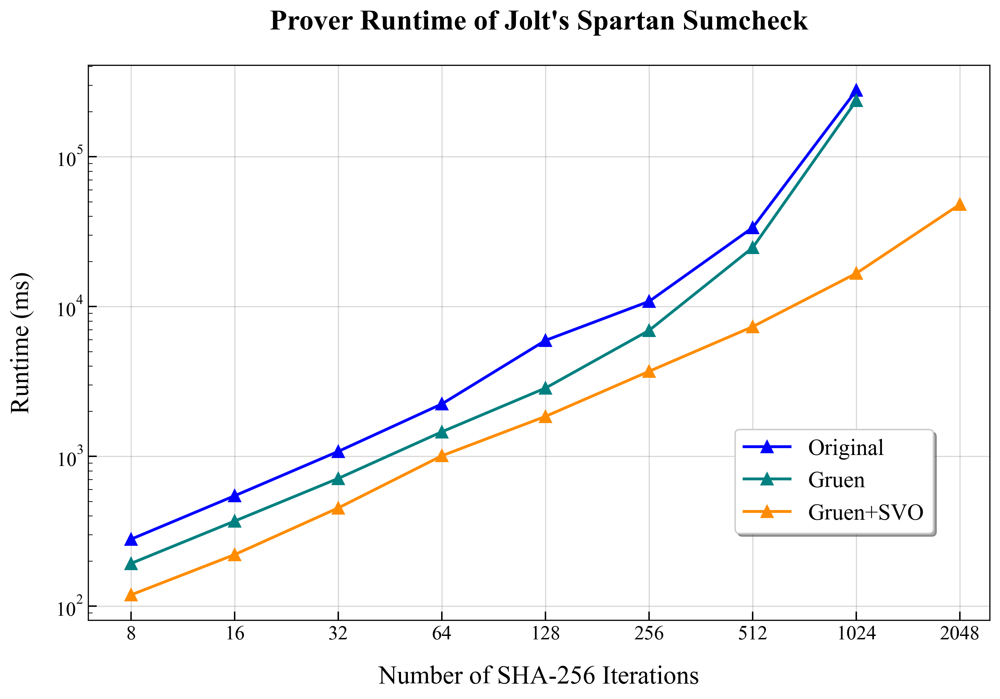

**Benchmark Results Summary (sha2-chain-guest):**

*   **8 Iterations:**
    *   Original: ~280 ms
    *   Gruen: ~193 ms (~31.1% faster than Original)
    *   Gruen + 3 SVO: ~119 ms (~38.3% faster than Gruen)

*   **16 Iterations:**
    *   Original: ~546 ms
    *   Gruen: ~370 ms (~32.2% faster than Original)
    *   Gruen + 3 SVO: ~221 ms (~40.3% faster than Gruen)

*   **32 Iterations:**
    *   Original: ~1.08 s
    *   Gruen: ~713 ms (~34.0% faster than Original)
    *   Gruen + 3 SVO: ~453 ms (~36.5% faster than Gruen)

*   **64 Iterations:**
    *   Original: ~2.24 s
    *   Gruen: ~1.46 s (~34.8% faster than Original)
    *   Gruen + 3 SVO: ~1.01 s (~30.9% faster than Gruen)

*   **128 Iterations:**
    *   Original: ~5.95 s
    *   Gruen: ~2.86 s (~51.9% faster than Original)
    *   Gruen + 3 SVO: ~1.85 s (~35.3% faster than Gruen)

*   **256 Iterations:**
    *   Original: ~10.84 s
    *   Gruen: ~6.94 s (~36.0% faster than Original)
    *   Gruen + 3 SVO: ~3.70 s (~46.7% faster than Gruen)

*   **512 Iterations:**
    *   Original: ~33.73 s
    *   Gruen: ~24.79 s (~26.5% faster than Original)
    *   Gruen + 3 SVO: ~7.35 s (~70.3% faster than Gruen)

*   **1024 Iterations:**
    *   Original: ~278.39 s
    *   Gruen: ~237.58 s (~14.7% faster than Original)
    *   Gruen + 3 SVO: ~16.69 s (~93.0% faster than Gruen)

*   **2048 Iterations:**
    *   Original: N/A (OOM / Timeout)
    *   Gruen: N/A (OOM / Timeout)
    *   Gruen + 3 SVO: ~48.20 s (Comparison N/A as Gruen data unavailable for 2048 iters)

Plot of the above:

**Key Observations:**
*   "Gruen + 3 SVO" consistently provides a very significant speedup over "Gruen" alone, especially at higher iteration counts.
*   "Gruen" consistently improves upon the "Original" implementation.
*   The "Gruen + 3 SVO" method is the only one able to complete 2048 iterations within reasonable time/memory constraints. 