# Jolt Prover DAG

This document shows the dependency graph between sumchecks in Jolt's proving system.

> **Note:** This file is auto-generated via static analysis of the codebase.
> Run: `cargo run -p jolt-core --bin generate-dag > book/src/how/architecture/jolt_dag.md`
> Do not edit manually.

## Color Legend

| Color | Component | Description |
|-------|-----------|-------------|
| Gray (`#555`) | **Spartan** | R1CS constraint system sumchecks |
| Blue (`#4a9eff`) | **Instruction** | Instruction lookup sumchecks |
| Red (`#ff6b6b`) | **RAM** | RAM read/write and address sumchecks |
| Green (`#4caf50`) | **Registers** | Register read/write sumchecks |
| Cyan (`#00bcd4`) | **Bytecode** | Bytecode read/address sumchecks |
| Orange (`#ff9800`) | **Mixed/Opening** | Cross-component sumchecks (Booleanity, Inc, HW, BatchOpening) |

## Stage Overview

| Stage | Sumchecks |
|-------|-----------|
| 1 | SpartanOuter |
| 2 | SpartanProductVirtualization, InstructionClaimReduction, RamReadWriteChecking, RamRafEvaluation, RamOutputCheck |
| 3 | SpartanShift, InstructionInputVirtualization, RegistersClaimReduction |
| 4 | RamValEvaluation, RamValFinalEvaluation, RegistersReadWriteChecking |
| 5 | InstructionReadRaf, RamRaClaimReduction, RegistersValEvaluation |
| 6 | InstructionRaVirtualization, RamHammingBooleanity, RamRaVirtualization, BytecodeReadRaf, Booleanity, IncClaimReduction |
| 7 | HammingWeightClaimReduction |
| 8 | Batch Opening Proof |

## Full DAG with Dependencies

```mermaid
flowchart TD
    subgraph Stage1["Stage 1"]
        SpartanOuter[SpartanOuter]
    end

    subgraph Stage2["Stage 2"]
        SpartanProductVirt[SpartanProductVirtualization]
        InstrClaimRed[InstructionClaimReduction]
        RamRWCheck[RamReadWriteChecking]
        RamRafEval[RamRafEvaluation]
        RamOutCheck[RamOutputCheck]
    end

    subgraph Stage3["Stage 3"]
        SpartanShift[SpartanShift]
        InstrInputVirt[InstructionInputVirtualization]
        RegClaimRed[RegistersClaimReduction]
    end

    subgraph Stage4["Stage 4"]
        RamValEval[RamValEvaluation]
        RamValFinal[RamValFinalEvaluation]
        RegRWCheck[RegistersReadWriteChecking]
    end

    subgraph Stage5["Stage 5"]
        InstrReadRaf[InstructionReadRaf]
        RamRaClaimRed[RamRaClaimReduction]
        RegValEval[RegistersValEvaluation]
    end

    subgraph Stage6["Stage 6"]
        InstrRaVirt[InstructionRaVirtualization]
        RamHammingBool[RamHammingBooleanity]
        RamRaVirt[RamRaVirtualization]
        BytecodeReadRaf[BytecodeReadRaf]
        Booleanity[Booleanity]
        IncClaimRed[IncClaimReduction]
    end

    subgraph Stage7["Stage 7"]
        HWClaimRed[HammingWeightClaimReduction]
    end

    subgraph Stage8["Stage 8"]
        BatchOpening[Batch Opening Proof]
    end

    %% ============ Stage 1 → Stage 2 ============
    SpartanOuter -->|"Product"| SpartanProductVirt
    %% ============ Stage 1 → Stage 3 ============
    SpartanOuter -->|"NextIsFirstInSequence, NextIsVirtual, NextPC, NextUnexpandedPC"| SpartanShift
    %% ============ Stage 1 → Stage 2 ============
    SpartanOuter -->|"LeftLookupOperand, LookupOutput, RightLookupOperand"| InstrClaimRed
    %% ============ Stage 1 → Stage 3 ============
    SpartanOuter -->|"LeftInstructionInput, RightInstructionInput"| InstrInputVirt
    %% ============ Stage 1 → Stage 2 ============
    SpartanOuter -->|"RamReadValue, RamWriteValue"| RamRWCheck
    SpartanOuter -->|"RamAddress"| RamRafEval
    %% ============ Stage 1 → Stage 6 ============
    SpartanOuter -->|"LookupOutput"| RamHammingBool
    %% ============ Stage 1 → Stage 3 ============
    SpartanOuter -->|"LookupOutput, RdWriteValue, Rs1Value, Rs2Value"| RegClaimRed
    %% ============ Stage 1 → Stage 6 ============
    SpartanOuter -->|"Imm, OpFlags, PC, UnexpandedPC"| BytecodeReadRaf
    %% ============ Stage 2 → Stage 3 ============
    SpartanProductVirt -->|"NextIsNoop"| SpartanShift
    SpartanProductVirt -->|"LeftInstructionInput, RightInstructionInput"| InstrInputVirt
    %% ============ Stage 2 → Stage 5 ============
    SpartanProductVirt -->|"LookupOutput"| InstrReadRaf
    %% ============ Stage 2 → Stage 6 ============
    SpartanProductVirt -->|"InstructionFlags, OpFlags"| BytecodeReadRaf
    %% ============ Stage 3 → Stage 6 ============
    SpartanShift -->|"InstructionFlags, OpFlags, PC, UnexpandedPC"| BytecodeReadRaf
    %% ============ Stage 2 → Stage 5 ============
    InstrClaimRed -->|"LeftLookupOperand, LookupOutput, RightLookupOperand"| InstrReadRaf
    %% ============ Stage 3 → Stage 4 ============
    InstrInputVirt -->|"Rs1Value, Rs2Value"| RegRWCheck
    %% ============ Stage 3 → Stage 6 ============
    InstrInputVirt -->|"Imm, InstructionFlags, UnexpandedPC"| BytecodeReadRaf
    %% ============ Stage 5 → Stage 6 ============
    InstrReadRaf -->|"InstructionRa"| InstrRaVirt
    InstrReadRaf -->|"InstructionRafFlag, LookupTableFlag"| BytecodeReadRaf
    InstrReadRaf -->|"InstructionRa"| Booleanity
    %% ============ Stage 2 → Stage 4 ============
    RamRWCheck -->|"RamVal"| RamValEval
    %% ============ Stage 2 → Stage 5 ============
    RamRWCheck -->|"RamRa"| RamRaClaimRed
    %% ============ Stage 2 → Stage 6 ============
    RamRWCheck -->|"RamInc"| IncClaimRed
    %% ============ Stage 2 → Stage 5 ============
    RamRafEval -->|"RamRa"| RamRaClaimRed
    %% ============ Stage 2 → Stage 4 ============
    RamOutCheck -->|"RamValFinal, RamValInit"| RamValFinal
    %% ============ Stage 4 → Stage 5 ============
    RamValEval -->|"RamRa"| RamRaClaimRed
    %% ============ Stage 4 → Stage 6 ============
    RamValEval -->|"RamInc"| IncClaimRed
    %% ============ Stage 4 → Stage 5 ============
    RamValFinal -->|"RamRa"| RamRaClaimRed
    %% ============ Stage 4 → Stage 6 ============
    RamValFinal -->|"RamInc"| IncClaimRed
    %% ============ Stage 5 → Stage 6 ============
    RamRaClaimRed -->|"RamRa"| RamRaVirt
    %% ============ Stage 6 → Stage 7 ============
    RamHammingBool -->|"RamHammingWeight"| HWClaimRed
    %% ============ Stage 3 → Stage 4 ============
    RegClaimRed -->|"RdWriteValue, Rs1Value, Rs2Value"| RegRWCheck
    %% ============ Stage 4 → Stage 5 ============
    RegRWCheck -->|"RegistersVal"| RegValEval
    %% ============ Stage 4 → Stage 6 ============
    RegRWCheck -->|"RdWa, Rs1Ra"| BytecodeReadRaf
    RegRWCheck -->|"RdInc"| IncClaimRed
    %% ============ Stage 5 → Stage 6 ============
    RegValEval -->|"RdWa"| BytecodeReadRaf
    RegValEval -->|"RdInc"| IncClaimRed
    %% ============ Stage 6 → Stage 7 ============
    Booleanity -->|"InstructionRa"| HWClaimRed

    %% ============ Stage 7 → Stage 8 ============
    HWClaimRed -->|"All RA polys"| BatchOpening

    %% ============ Stage 6 → Stage 8 ============
    IncClaimRed -->|"RamInc, RdInc"| BatchOpening

    %% ============ Color Definitions ============
    classDef spartan fill:#555,stroke:#fff,color:#fff
    classDef instruction fill:#4a9eff,stroke:#fff,color:#fff
    classDef ram fill:#ff6b6b,stroke:#fff,color:#fff
    classDef registers fill:#4caf50,stroke:#fff,color:#fff
    classDef bytecode fill:#00bcd4,stroke:#fff,color:#fff
    classDef mixedopening fill:#ff9800,stroke:#fff,color:#fff

    class InstrInputVirt,SpartanOuter,SpartanProductVirt,SpartanShift spartan
    class InstrClaimRed,InstrRaVirt,InstrReadRaf instruction
    class RamHammingBool,RamOutCheck,RamRWCheck,RamRaClaimRed,RamRaVirt,RamRafEval,RamValEval,RamValFinal ram
    class RegClaimRed,RegRWCheck,RegValEval registers
    class BytecodeReadRaf bytecode
    class Booleanity,HWClaimRed,IncClaimRed,BatchOpening mixedopening
```



## How Dependencies are Extracted

Dependencies are extracted via static analysis of the source code by scanning for:

```rust
// Pattern: get_*_opening(..., SumcheckId::SOURCE)
// The SOURCE sumcheck produces the opening
// The file containing the call determines the consuming sumcheck
accumulator.get_virtual_polynomial_opening(
    VirtualPolynomial::X,
    SumcheckId::SOURCE,  // <- This is the producer
);
```

## SumcheckId Reference

All sumcheck identifiers (from `opening_proof.rs`):

```rust
pub enum SumcheckId {
    SpartanOuter,
    SpartanProductVirtualization,
    InstructionClaimReduction,
    RamReadWriteChecking,
    RamRafEvaluation,
    RamOutputCheck,
    SpartanShift,
    InstructionInputVirtualization,
    RegistersClaimReduction,
    RamValEvaluation,
    RamValFinalEvaluation,
    RegistersReadWriteChecking,
    InstructionReadRaf,
    RamRaClaimReduction,
    RegistersValEvaluation,
    InstructionRaVirtualization,
    RamHammingBooleanity,
    RamRaVirtualization,
    BytecodeReadRaf,
    Booleanity,
    IncClaimReduction,
    HammingWeightClaimReduction,
}
```
