# Jolt Prover DAG

This document shows the dependency graph between sumchecks in Jolt's proving system.

## Color Legend

| Color | Component | Description |
|-------|-----------|-------------|
| Gray (`#555`) | **Spartan** | R1CS constraint system sumchecks |
| Blue (`#4a9eff`) | **Instruction** | Instruction lookup sumchecks |
| Red (`#ff6b6b`) | **RAM** | RAM read/write and address sumchecks |
| Green (`#4caf50`) | **Registers** | Register read/write sumchecks |
| Cyan (`#00bcd4`) | **Bytecode** | Bytecode read/address sumchecks |
| Orange (`#ff9800`) | **Mixed/Opening** | Cross-component sumchecks (Booleanity, Inc, HW, BatchOpening) |

## Stage Overview

| Stage | Sumchecks |
|-------|-----------|
| 1 | SpartanOuter |
| 2 | SpartanProductVirtualization, RamRafEvaluation, RamReadWriteChecking, RamOutputCheck, InstructionClaimReduction |
| 3 | SpartanShift, InstructionInputVirtualization, RegistersClaimReduction |
| 4 | RegistersReadWriteChecking, RamValEvaluation, RamValFinalEvaluation |
| 5 | RegistersValEvaluation, RamRaClaimReduction, InstructionReadRaf |
| 6 | BytecodeReadRaf, RamHammingBooleanity, Booleanity, RamRaVirtualization, InstructionRaVirtualization, IncClaimReduction |
| 7 | HammingWeightClaimReduction |
| 8 | Batch Opening Proof |

## Full DAG with Dependencies

```mermaid
flowchart TD
    subgraph Stage1["Stage 1"]
        SpartanOuter[SpartanOuter]
    end

    subgraph Stage2["Stage 2"]
        SpartanProductVirt[SpartanProductVirtualization]
        RamRafEval[RamRafEvaluation]
        RamRWCheck[RamReadWriteChecking]
        RamOutCheck[RamOutputCheck]
        InstrClaimRed[InstructionClaimReduction]
    end

    subgraph Stage3["Stage 3"]
        SpartanShift[SpartanShift]
        InstrInputVirt[InstructionInputVirtualization]
        RegClaimRed[RegistersClaimReduction]
    end

    subgraph Stage4["Stage 4"]
        RegRWCheck[RegistersReadWriteChecking]
        RamValEval[RamValEvaluation]
        RamValFinal[RamValFinalEvaluation]
    end

    subgraph Stage5["Stage 5"]
        RegValEval[RegistersValEvaluation]
        RamRaClaimRed[RamRaClaimReduction]
        InstrReadRaf[InstructionReadRaf]
    end

    subgraph Stage6["Stage 6"]
        BytecodeReadRaf[BytecodeReadRaf]
        RamHammingBool[RamHammingBooleanity]
        Booleanity[Booleanity]
        RamRaVirt[RamRaVirtualization]
        InstrRaVirt[InstructionRaVirtualization]
        IncClaimRed[IncClaimReduction]
    end

    subgraph Stage7["Stage 7"]
        HWClaimRed[HammingWeightClaimReduction]
    end

    subgraph Stage8["Stage 8"]
        BatchOpening[Batch Opening Proof]
    end

    %% ============ Stage 1 → Stage 2 ============
    SpartanOuter -->|"Product, ProductConstraints"| SpartanProductVirt
    SpartanOuter -->|"RamAddress"| RamRafEval
    SpartanOuter -->|"LookupOutput, Left/RightOperand"| InstrClaimRed

    %% ============ Stage 1 → Stage 3 ============
    SpartanOuter -->|"NextPC, NextUnexpandedPC, NextIsVirtual, NextIsFirstInSequence"| SpartanShift
    SpartanOuter -->|"Left/RightInstructionInput"| InstrInputVirt
    SpartanOuter -->|"RdWriteValue, Rs1/Rs2Value, LookupOutput"| RegClaimRed

    %% ============ Stage 2 → Stage 3 ============
    SpartanProductVirt -->|"NextIsNoop"| SpartanShift
    SpartanProductVirt -->|"Left/RightInstructionInput"| InstrInputVirt

    %% ============ Stage 3 → Stage 4 ============
    RegClaimRed -->|"RdWriteValue, Rs1/Rs2Value"| RegRWCheck

    %% ============ Stage 2 → Stage 4 ============
    RamRWCheck -->|"RamVal"| RamValEval
    RamRWCheck -->|"RamVal"| RamValFinal

    %% ============ Stage 4 → Stage 5 ============
    RegRWCheck -->|"RegistersVal"| RegValEval
    RamValEval -->|"RamRa"| RamRaClaimRed
    RamValFinal -->|"RamRa"| RamRaClaimRed

    %% ============ Stage 2 → Stage 5 ============
    RamRafEval -->|"RamRa"| RamRaClaimRed
    RamRWCheck -->|"RamRa"| RamRaClaimRed
    InstrClaimRed -->|"LookupOutput"| InstrReadRaf
    SpartanProductVirt -->|"LookupOutput (Branch)"| InstrReadRaf

    %% ============ Stage 5 → Stage 6 ============
    RamRaClaimRed -->|"RamRa"| RamRaVirt
    InstrReadRaf -->|"InstructionRa(i)"| InstrRaVirt
    InstrReadRaf -->|"InstructionRa (r_cycle)"| Booleanity
    InstrReadRaf -->|"InstructionRafFlag, LookupTableFlag"| BytecodeReadRaf
    RegValEval -->|"RdWa"| BytecodeReadRaf
    RegValEval -->|"RdInc"| IncClaimRed

    %% ============ Stage 4 → Stage 6 ============
    RegRWCheck -->|"Rs1Ra, RdWa"| BytecodeReadRaf
    RegRWCheck -->|"RdInc"| IncClaimRed
    RamValEval -->|"RamInc"| IncClaimRed

    %% ============ Stage 2 → Stage 6 ============
    RamRWCheck -->|"RamInc"| IncClaimRed

    %% ============ Stage 1 → Stage 6 ============
    SpartanOuter -->|"LookupOutput (r_cycle)"| RamHammingBool
    SpartanOuter -->|"PC, UnexpandedPC, Imm, OpFlags"| BytecodeReadRaf

    %% ============ Stage 2 → Stage 6 ============
    SpartanProductVirt -->|"Jump, Branch, IsRdNotZero, WriteLookupOutputToRD"| BytecodeReadRaf

    %% ============ Stage 3 → Stage 6 ============
    SpartanShift -->|"UnexpandedPC, IsNoop, VirtualInstr, IsFirstInSeq"| BytecodeReadRaf
    InstrInputVirt -->|"Imm, UnexpandedPC, operand flags"| BytecodeReadRaf

    %% ============ Stage 6 → Stage 7 ============
    Booleanity -->|"InstructionRa, BytecodeRa, RamRa claims"| HWClaimRed
    BytecodeReadRaf -->|"BytecodeRa(i)"| HWClaimRed
    RamRaVirt -->|"RamRa(i)"| HWClaimRed
    InstrRaVirt -->|"InstructionRa(i)"| HWClaimRed
    RamHammingBool -->|"RamHammingWeight"| HWClaimRed

    %% ============ Stage 7 → Stage 8 ============
    HWClaimRed -->|"All RA polys"| BatchOpening

    %% ============ Stage 6 → Stage 8 ============
    IncClaimRed -->|"RamInc, RdInc"| BatchOpening

    %% ============ Color Definitions ============
    classDef spartan fill:#555,stroke:#fff,color:#fff
    classDef instruction fill:#4a9eff,stroke:#fff,color:#fff
    classDef ram fill:#ff6b6b,stroke:#fff,color:#fff
    classDef registers fill:#4caf50,stroke:#fff,color:#fff
    classDef bytecode fill:#00bcd4,stroke:#fff,color:#fff
    classDef mixed fill:#ff9800,stroke:#fff,color:#fff

    class SpartanOuter,SpartanProductVirt,SpartanShift,InstrInputVirt spartan
    class InstrClaimRed,InstrReadRaf,InstrRaVirt instruction
    class RamRafEval,RamRWCheck,RamOutCheck,RamValEval,RamValFinal,RamRaClaimRed,RamHammingBool,RamRaVirt ram
    class RegClaimRed,RegRWCheck,RegValEval registers
    class BytecodeReadRaf bytecode
    class Booleanity,IncClaimRed,HWClaimRed,BatchOpening mixed
```



## SumcheckId Reference

All sumcheck identifiers (from `opening_proof.rs`):

```rust
pub enum SumcheckId {
    SpartanOuter,
    SpartanProductVirtualization,
    SpartanShift,
    InstructionClaimReduction,
    InstructionInputVirtualization,
    InstructionReadRaf,
    InstructionRaVirtualization,
    RamReadWriteChecking,
    RamRafEvaluation,
    RamOutputCheck,
    RamValEvaluation,
    RamValFinalEvaluation,
    RamRaClaimReduction,
    RamHammingBooleanity,
    RamRaVirtualization,
    RegistersClaimReduction,
    RegistersReadWriteChecking,
    RegistersValEvaluation,
    BytecodeReadRaf,
    Booleanity,
    IncClaimReduction,
    HammingWeightClaimReduction,
}
```

## Key Polynomial Types

### Committed Polynomials
- `InstructionRa(i)` - Instruction read address chunks
- `BytecodeRa(i)` - Bytecode read address chunks  
- `RamRa(i)` - RAM read address chunks
- `RamInc` - RAM increment polynomial
- `RdInc` - Register destination increment polynomial

### Virtual Polynomials
- `Product`, `LookupOutput`, `Left/RightLookupOperand` - Instruction lookup related
- `RamAddress`, `RamVal`, `RamRa` - RAM related
- `RegistersVal`, `Rs1Ra`, `Rs2Ra`, `RdWa` - Register related
- `PC`, `UnexpandedPC`, `Imm` - Program counter related
- `RamHammingWeight` - RAM Hamming weight
- Various `OpFlags` and `InstructionFlags`

## Generating This Diagram Programmatically

To generate this DAG from Rust code, you could instrument the `OpeningAccumulator`:

```rust
#[cfg(test)]
pub struct DependencyTracker {
    dependencies: HashMap<SumcheckId, Vec<(OpeningId, DepType)>>,
    current_sumcheck: Option<SumcheckId>,
}

enum DepType { Consumed, Produced }

// Hook into get_* methods to track Consumed
// Hook into append_* methods to track Produced
// Then build edges: if sumcheck A produces X and sumcheck B consumes X, add edge A → B
```

This would allow automatic DAG generation during test runs.

