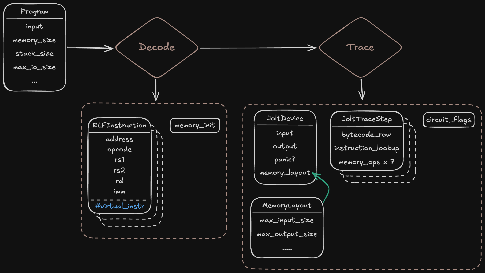
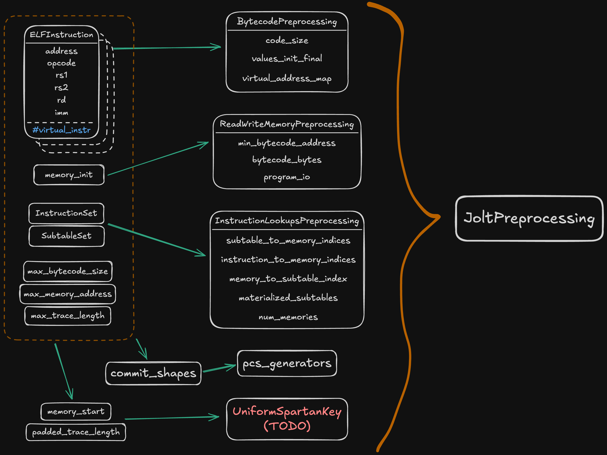
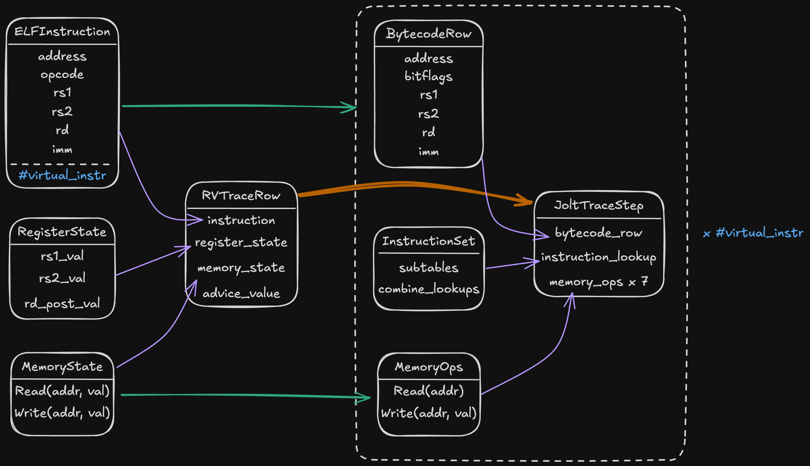

## Anatomy of a Jolt proof

In this section, we give a full specification on the format of a Jolt proof, how it is generated, and the constraints it imposes on the Jolt witness.

(prove: program's IO => Jolt preprocessing => Jolt witness => Jolt proof)

(verify: program's IO => Jolt preprocessing => Jolt proof => accept/reject)

### Preprocessing for Jolt

### Generating a Jolt witness

### Format of a Jolt proof

### Constraints on the Jolt witness

(potentially merge this with other parts of this section once this is finished)